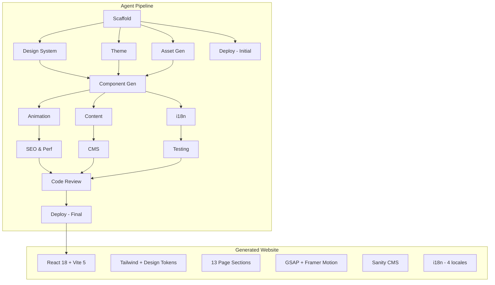

# Aletheia AI Website — Engineering Guide

> Full implementation guide for the Aletheia AI marketing website and its AI-powered development agent system.

---

## 1. Project Overview

### 1.1 Vision
Build a premium, single-page marketing website for **Aletheia AI** — an AI engineering and cybersecurity agency — using an automated agent pipeline that generates production-quality React code from a PRD specification.

### 1.2 Goals
- **Premium Aesthetic**: Dark, futuristic, technically sophisticated design rivaling top agency sites
- **Performance**: Lighthouse 90+ across all categories, LCP < 2.5s, CLS < 0.1
- **Accessibility**: WCAG 2.1 AA compliance, keyboard navigable, screen reader friendly
- **SEO**: Structured data, meta optimization, 5,000+ monthly visitors within 3 months
- **Internationalization**: Multi-language support (EN, ES, FR, DE)
- **Dynamic Content**: Sanity CMS integration for team-managed content

### 1.3 Tech Stack

| Layer | Technology | Rationale |
|-------|-----------|-----------|
| **Framework** | React 18 + TypeScript 5 | Type safety, ecosystem maturity, team familiarity |
| **Build Tool** | Vite 5+ | Fastest HMR, native ESM, optimized production builds |
| **Styling** | Tailwind CSS 3 | Utility-first, design token integration, tree-shakeable |
| **Animation** | GSAP + Framer Motion | GSAP for scroll timelines, FM for React-native transitions |
| **Testing** | Vitest + RTL + axe-core | Fast, React-integrated, accessibility-first |
| **Component Dev** | Storybook 8 | Visual review, isolated development, design handoff |
| **CMS** | Sanity Studio | Real-time collaboration, TypeScript SDK, GROQ queries |
| **i18n** | react-i18next | Most mature React i18n, SSG-compatible |
| **Hosting** | Vercel | Edge network, preview deploys, zero-config |
| **CI/CD** | GitHub Actions | PR checks, Lighthouse CI, automated deploys |
| **Agent System** | TypeScript + Claude API | Automated code generation, review, and optimization |

### 1.4 Architecture Diagram



### 1.5 Repository Structure

```
aletheia-ai/
├── agents/                          # Agent system
│   ├── package.json                 # Agent workspace dependencies
│   ├── tsconfig.json                # Strict TS config
│   ├── src/
│   │   ├── orchestrator/            # Pipeline engine
│   │   │   ├── index.ts             # CLI entry (commander)
│   │   │   ├── pipeline.ts          # DAG-based stage executor
│   │   │   ├── state.ts             # JSON file-backed state store
│   │   │   ├── logger.ts            # Structured logging with colors
│   │   │   └── config.ts            # Layered config loader (YAML)
│   │   ├── core/                    # Shared infrastructure
│   │   │   ├── base-agent.ts        # Abstract base (plan→execute→validate)
│   │   │   ├── claude-client.ts     # Anthropic SDK wrapper
│   │   │   ├── file-ops.ts          # Safe file read/write/patch/rollback
│   │   │   ├── shell.ts             # Shell command runner
│   │   │   ├── template.ts          # EJS template engine
│   │   │   ├── validator.ts         # Zod-based I/O validation
│   │   │   └── types.ts             # Shared TypeScript types
│   │   ├── agents/                  # 13 specialized agents
│   │   │   ├── registry.ts          # Agent factory registry
│   │   │   ├── scaffold/            # Project initialization
│   │   │   ├── design-system/       # Brand tokens + UI components
│   │   │   ├── theme/               # Dark/light mode system
│   │   │   ├── asset-gen/           # SVG icons, favicons, OG images
│   │   │   ├── component-gen/       # 13 PRD section components
│   │   │   ├── animation/           # GSAP + Framer Motion
│   │   │   ├── content/             # Marketing copy + SEO
│   │   │   ├── i18n/                # Internationalization
│   │   │   ├── cms/                 # Sanity integration
│   │   │   ├── seo-perf/            # Performance optimization
│   │   │   ├── testing/             # Test generation
│   │   │   ├── deploy/              # CI/CD + hosting
│   │   │   └── code-review/         # Quality gate
│   │   └── prompts/                 # System prompts (versioned .md)
│   │       ├── scaffold/v1.md
│   │       ├── design-system/v1.md
│   │       └── ...
│   ├── configs/
│   │   ├── agents.yaml              # Per-agent model, tokens, settings
│   │   ├── pipeline.yaml            # DAG execution order
│   │   └── project.yaml             # Company/product/brand config
│   └── tests/
├── website/                         # Generated website
│   ├── src/
│   │   ├── components/
│   │   │   ├── ui/                  # Button, Card, GlassPanel, ...
│   │   │   ├── layout/              # Navbar, Footer, Container
│   │   │   ├── sections/            # Hero/, About/, Services/, ...
│   │   │   └── shared/              # Preloader, CustomCursor, Marquee
│   │   ├── hooks/                   # useScrollTrigger, useTheme, ...
│   │   ├── lib/                     # cn(), analytics, sanity client
│   │   ├── data/                    # Static data (services, products, ...)
│   │   ├── locales/                 # i18n translation files
│   │   └── types/                   # Shared TS types + design tokens
│   ├── public/
│   │   ├── images/                  # Generated assets
│   │   ├── fonts/                   # Self-hosted WOFF2
│   │   └── favicon/                 # Favicon set
│   ├── .storybook/                  # Storybook config
│   ├── tailwind.config.ts
│   ├── vite.config.ts
│   └── package.json
├── docs/
│   └── Engineering.md               # This file
├── .env.example
├── .gitignore
└── package.json                     # Root workspace config
```

---

## 2. Getting Started

### 2.1 Prerequisites

- **Node.js** >= 20.0.0
- **npm** >= 10.0.0
- **Git** >= 2.40
- **Anthropic API Key** (for running agents)

### 2.2 Environment Setup

```bash
# Clone the repository
git clone https://github.com/aletheia-ai/website.git
cd website

# Copy environment variables
cp .env.example .env

# Edit .env and add your Anthropic API key
# ANTHROPIC_API_KEY=sk-ant-...
```

### 2.3 Installation

```bash
# Install all workspace dependencies
npm install

# Verify the agent system
cd agents && npx tsx src/orchestrator/index.ts --help
```

### 2.4 Running the Agent Pipeline

```bash
# Run the full pipeline (interactive mode — recommended for first run)
cd agents
npx tsx src/orchestrator/index.ts run

# Run in auto mode (no confirmations)
npx tsx src/orchestrator/index.ts run --auto

# Run a specific agent
npx tsx src/orchestrator/index.ts run --agent=component-gen

# Resume from a specific stage
npx tsx src/orchestrator/index.ts run --from=enhance
```

### 2.5 Development Server

```bash
# Start the website dev server
cd website
npm run dev           # Vite dev server at http://localhost:5173

# Start Storybook
npm run storybook     # Storybook at http://localhost:6006
```

### 2.6 Build & Preview

```bash
cd website
npm run build         # Production build to dist/
npm run preview       # Preview production build locally
```

---

## 3. Agent System

### 3.1 What Are Agents?

Agents are specialized TypeScript programs powered by the Claude API that automate specific aspects of website development. Each agent:

1. **Plans** — Analyzes the current state and creates an execution plan
2. **Executes** — Generates code, configs, or content using Claude
3. **Validates** — Verifies the output meets quality standards
4. **Reports** — Logs files created, tokens used, and any issues

### 3.2 The 13 Agents

| # | Agent | Model | Purpose |
|---|-------|-------|---------|
| 1 | `scaffold` | Sonnet | Initialize Vite + React + Tailwind + Storybook project |
| 2 | `design-system` | Sonnet | Generate brand tokens, Tailwind config, UI component library |
| 3 | `theme` | Sonnet | Implement dark/light mode with CSS variables |
| 4 | `asset-gen` | Sonnet | Generate SVG icons, favicons, OG images, product logos |
| 5 | `component-gen` | Sonnet | Generate all 13 PRD section components + Storybook stories |
| 6 | `animation` | Sonnet | Add GSAP ScrollTrigger + Framer Motion animations |
| 7 | `content` | Opus | Generate marketing copy, SEO metadata, structured data |
| 8 | `i18n` | Sonnet | Set up react-i18next with translation files |
| 9 | `cms` | Sonnet | Configure Sanity Studio with typed schemas and hooks |
| 10 | `seo-perf` | Sonnet | Audit Lighthouse, optimize bundle, set up analytics |
| 11 | `testing` | Sonnet | Generate unit, accessibility, and E2E tests |
| 12 | `deploy` | Haiku | Configure Vercel, GitHub Actions, security headers |
| 13 | `code-review` | Opus | Review all code for quality, security, best practices |

### 3.3 Pipeline Stages

The agents execute in a DAG (Directed Acyclic Graph) with 7 stages:

```
Stage 1: Init       → scaffold
Stage 2: Foundation → design-system, theme, asset-gen, deploy (parallel)
Stage 3: Build      → component-gen
Stage 4: Enhance    → animation, content, i18n (parallel)
Stage 5: Quality    → seo-perf, cms, testing (parallel)
Stage 6: Review     → code-review
Stage 7: Finalize   → deploy (final run)
```

### 3.4 CLI Reference

```bash
# Pipeline execution
npx agents run                             # Full pipeline (interactive)
npx agents run --auto                      # Skip all confirmations
npx agents run --stage=build               # Run a specific stage
npx agents run --agent=animation           # Run a single agent
npx agents run --from=enhance              # Resume from a stage
npx agents run --agent=content --prompt-version=v2  # Use specific prompt version

# State management
npx agents status                          # Show pipeline state & progress
npx agents reset                           # Clear all state (start fresh)
npx agents reset --agent=component-gen     # Reset one agent only
npx agents undo <agent>                    # Rollback an agent's file changes

# Quality tools
npx agents review                          # Run code-review agent
npx agents audit                           # Run seo-perf audit
npx agents test                            # Run testing agent

# Development
npx agents storybook                       # Start Storybook
npx agents preview                         # Build + serve locally
npx agents cost                            # Show API token usage & cost
```

### 3.5 Configuration

#### agents.yaml — Per-Agent Settings

```yaml
agents:
  component-gen:
    enabled: true
    model: "claude-sonnet-4-20250514"     # Claude model to use
    max_tokens: 150000                     # Token budget
    temperature: 0                         # Deterministic output
    timeout: 600                           # Seconds before timeout
    retries: 2                             # Retry on failure
    approval_required: true                # Interactive approval
    prompt_version: "v1"                   # System prompt version
    config:                                # Agent-specific settings
      sections: "all"
      generateStories: true
```

#### pipeline.yaml — Execution Order

Defines the DAG stages, which agents run in each stage, whether they run in parallel, and their dependencies.

#### project.yaml — Company & Product Data

Contains company name, domain, tagline, product definitions (Inscrape, Nirvana, SwarmScope), service list, analytics IDs, and Claude API settings.

### 3.6 Creating a Custom Agent

1. Create `agents/src/agents/<name>/index.ts`:

```typescript
import { z } from "zod";
import { BaseAgent } from "../../core/base-agent.js";
import type { AgentName, AgentPlan, ValidationResult } from "../../core/types.js";

const InputSchema = z.object({ /* ... */ });
const OutputSchema = z.object({ /* ... */ });

export class MyAgent extends BaseAgent<z.infer<typeof InputSchema>, z.infer<typeof OutputSchema>> {
  readonly name: AgentName = "my-agent" as AgentName;
  readonly description = "What this agent does";
  readonly inputSchema = InputSchema;
  readonly outputSchema = OutputSchema;

  async plan(input) { /* Return AgentPlan */ }
  async execute(input, plan) { /* Generate code, return output */ }
  async validate(output) { /* Return ValidationResult */ }
}
```

2. Register in `agents/src/agents/registry.ts`
3. Add config to `agents/configs/agents.yaml`
4. Add to appropriate stage in `agents/configs/pipeline.yaml`
5. Write system prompt in `agents/src/prompts/<name>/v1.md`

### 3.7 Prompt Engineering Guide

System prompts live in `agents/src/prompts/<agent>/v1.md` and are the primary lever for controlling output quality.

**Best practices:**
- Be specific about the output format (TypeScript, React component structure)
- Include the design system tokens so Claude can reference them
- Specify the exact Tailwind classes and patterns to use
- Include examples of desired output for complex components
- Mention anti-patterns to avoid (no `any` types, no inline styles)
- Reference accessibility requirements explicitly

**Prompt versioning:**
- Each prompt version is stored as `v1.md`, `v2.md`, etc.
- A `current` symlink points to the active version
- `changelog.md` tracks what changed and why
- A/B test with: `npx agents compare --agent=content --versions=v1,v2`

### 3.8 Cost Tracking

Each agent's API usage is tracked in the state store:

```bash
npx agents cost
```

Output shows per-agent token counts and costs. Model pricing:
- **Opus**: $15/M input, $75/M output (used for content + code-review)
- **Sonnet**: $3/M input, $15/M output (used for most code gen)
- **Haiku**: $0.80/M input, $4/M output (used for deploy configs)

A typical full pipeline run costs approximately $2-5 in API usage.

---

## 4. Architecture

### 4.1 Component Architecture

Every section follows a consistent pattern:

```
src/components/sections/Hero/
├── index.tsx              # Main component (exported)
├── HeroParticles.tsx      # Subcomponent
├── HeroCTA.tsx            # Subcomponent
├── Hero.stories.tsx       # Storybook stories
└── types.ts               # Section-specific types
```

**Section component contract:**
```typescript
// Every section component follows this pattern
export default function Hero() {
  return (
    <section
      id="hero"                              // Matches SectionId
      className="relative min-h-screen ..."  // Full viewport by default
      aria-label="Hero section"              // Accessible label
    >
      <Container>
        {/* Section content */}
      </Container>
    </section>
  );
}
```

### 4.2 UI Component Library

Reusable primitives generated by the `design-system` agent:

| Component | Variants | Description |
|-----------|----------|-------------|
| `Button` | primary, secondary, ghost, outline | Sizes: sm, md, lg. Supports loading state, icons |
| `Card` | glass, bordered, elevated | Hover lift effect, responsive padding |
| `GlassPanel` | default, strong, subtle | Frosted glass with backdrop-blur |
| `Badge` | default, success, warning, accent | Inline status indicators |
| `Container` | default, narrow, wide | Max-width wrapper with responsive padding |
| `SectionHeading` | default, centered, left | Overline + h2 + description pattern |
| `GradientText` | accent, warm, cool | Gradient color applied to text |
| `AnimatedCounter` | default | Counts up when visible (IntersectionObserver) |

### 4.3 Data Flow

```
┌──────────────┐     ┌──────────────┐     ┌──────────────┐
│  Sanity CMS   │────>│  React Hooks  │────>│  Components   │
│  (Dynamic)    │     │  useServices  │     │  <Services>   │
└──────────────┘     │  useProducts  │     └──────────────┘
                      └──────┬───────┘
┌──────────────┐             │
│  Static Data  │─────fallback
│  src/data/    │
└──────────────┘
```

Components always work with static data as fallback. CMS data overrides when available.

### 4.4 Styling Architecture

**Tailwind Configuration:**
- Custom color palette with full shade scales (50-950)
- Custom fonts: Inter (body), Space Grotesk (headings), JetBrains Mono (code)
- Extended spacing, border-radius, and shadow tokens
- Custom animations: fadeIn, slideUp, scaleIn
- Breakpoints: mobile (375px), tablet (768px), desktop (1024px), xl (1440px)

**CSS Variables:**
```css
:root {
  --color-primary: #0a0a1a;
  --color-accent: #00d4ff;
  --color-surface: rgba(255, 255, 255, 0.05);
  --glass-blur: 12px;
  --glass-border: rgba(255, 255, 255, 0.1);
}

[data-theme="light"] {
  --color-primary: #ffffff;
  --color-accent: #0066ff;
  --color-surface: rgba(0, 0, 0, 0.02);
}
```

**Responsive Strategy:**
- Mobile-first approach (`min-width` breakpoints)
- Fluid typography with `clamp()`
- Grid layouts collapse gracefully
- Touch-friendly tap targets (48px minimum)

### 4.5 Animation Architecture

**Decision Matrix:**

| Use Case | Library | Reason |
|----------|---------|--------|
| Scroll-triggered entrances | GSAP ScrollTrigger | Superior scroll precision and timeline control |
| Component mount/unmount | Framer Motion | React-native `AnimatePresence` |
| Layout transitions | Framer Motion | `layoutId` for shared element transitions |
| Complex timelines | GSAP | Timeline sequencing, scrub, pin |
| Hover effects | CSS/Framer Motion | CSS for simple, FM for complex |
| Infinite loops (marquee) | CSS `@keyframes` | Zero JS overhead |
| Number counting | Custom hook | IntersectionObserver + requestAnimationFrame |

**Performance Rules:**
- Only animate `transform` and `opacity` (GPU-accelerated)
- Use `will-change` sparingly, remove after animation completes
- Respect `prefers-reduced-motion` — disable parallax, reduce entrances to fades
- Stagger animations to avoid simultaneous paint operations
- Lazy-initialize GSAP ScrollTrigger for below-fold sections

### 4.6 Internationalization Architecture

```
src/locales/
├── en/
│   ├── common.json        # Shared strings (nav, footer, CTAs)
│   ├── hero.json           # Hero section copy
│   ├── services.json       # Service descriptions
│   ├── products.json       # Product details
│   └── contact.json        # Contact form labels
├── es/
│   └── ... (same structure)
├── fr/
└── de/
```

**Language Detection Flow:**
1. Check URL prefix (`/es/`, `/fr/`)
2. Check `localStorage` for saved preference
3. Check `navigator.language`
4. Fall back to English

### 4.7 CMS Architecture (Sanity)

**Content Schemas:**

| Schema | Fields | Used By |
|--------|--------|---------|
| `service` | name, description, icon, order | Services section |
| `product` | name, tagline, description, features, gradient, logo | Products section |
| `caseStudy` | title, client, industry, challenge, solution, results, image | Case Studies |
| `testimonial` | quote, author, role, company, avatar | Testimonials |

**Data Hooks:**
```typescript
// Auto-generated by CMS agent
export function useServices(): { data: Service[]; loading: boolean } { ... }
export function useProducts(): { data: Product[]; loading: boolean } { ... }
export function useCaseStudies(): { data: CaseStudy[]; loading: boolean } { ... }
export function useTestimonials(): { data: Testimonial[]; loading: boolean } { ... }
```

Each hook falls back to static data from `src/data/` if CMS is unavailable.

---

## 5. Design System

### 5.1 Colors

**Dark Theme (Default):**

| Token | Hex | Usage |
|-------|-----|-------|
| `primary-950` | `#0a0a1a` | Page background |
| `primary-900` | `#111128` | Section backgrounds |
| `primary-800` | `#1a1a3e` | Card backgrounds |
| `accent-400` | `#00d4ff` | Primary accent, links, CTAs |
| `accent-500` | `#0099cc` | Hover states |
| `accent-600` | `#0066ff` | Active states |
| `neutral-50` | `#f8fafc` | Primary text |
| `neutral-300` | `#94a3b8` | Secondary text |
| `neutral-500` | `#64748b` | Muted text |

**Product Gradients:**
- Inscrape: `#00D4FF` → `#0066FF` (Cyan-Blue)
- Nirvana: `#FF6B6B` → `#FF2D55` (Coral-Red)
- SwarmScope: `#7B61FF` → `#00D4FF` (Purple-Cyan)

### 5.2 Typography

| Level | Font | Size | Weight | Line Height |
|-------|------|------|--------|-------------|
| Display | Space Grotesk | 4.5rem (72px) | 700 | 1.1 |
| H1 | Space Grotesk | 3.75rem (60px) | 700 | 1.1 |
| H2 | Space Grotesk | 2.25rem (36px) | 600 | 1.2 |
| H3 | Space Grotesk | 1.5rem (24px) | 600 | 1.3 |
| Body Large | Inter | 1.125rem (18px) | 400 | 1.6 |
| Body | Inter | 1rem (16px) | 400 | 1.6 |
| Small | Inter | 0.875rem (14px) | 400 | 1.5 |
| Overline | Inter | 0.75rem (12px) | 600 | 1.5 |

### 5.3 Spacing & Layout

| Token | Value | Usage |
|-------|-------|-------|
| `section-y` | `6rem (96px)` / `8rem (128px)` xl | Vertical section padding |
| `container-max` | `1280px` | Max content width |
| `container-px` | `1rem` mobile / `2rem` desktop | Horizontal padding |
| `card-p` | `1.5rem` / `2rem` xl | Card internal padding |
| `gap-grid` | `1.5rem` / `2rem` xl | Grid gap |

### 5.4 Effects

**Frosted Glass:**
```css
.glass-panel {
  background: rgba(255, 255, 255, 0.05);
  backdrop-filter: blur(12px);
  border: 1px solid rgba(255, 255, 255, 0.1);
  border-radius: 1rem;
}
```

**Glow Effect:**
```css
.glow {
  box-shadow: 0 0 20px rgba(0, 212, 255, 0.15),
              0 0 60px rgba(0, 212, 255, 0.05);
}
```

---

## 6. Section Implementation Guide

### 6.1 Preloader
- Full-screen overlay with Aletheia logo pulsing animation
- Minimum display: 1.5 seconds
- Fade out with `opacity` + `pointer-events: none`
- State managed via `useState` in `App.tsx`
- Logo pulse: CSS `@keyframes` with `scale` and `opacity`

### 6.2 Navbar
- Fixed position, frosted glass (`backdrop-blur`)
- Transparent at top, opaque on scroll (IntersectionObserver)
- Hide on scroll down, show on scroll up
- Mobile: hamburger menu with slide-in panel
- Logo left, nav links center, CTA button right
- Smooth scroll to section on nav link click

### 6.3 Hero
- Full viewport height (`min-h-screen`)
- Animated headline with staggered word entrance
- Particle/grid background animation (canvas or CSS)
- Two CTAs: primary ("Get Started") + secondary ("View Our Work")
- Scroll indicator at bottom (animated chevron)
- Parallax on background elements

### 6.4 Marquee
- Infinite horizontal scroll of keywords/phrases
- Two strips scrolling in opposite directions
- Content duplicated for seamless loop
- Pure CSS animation (`translateX`) for zero JS overhead
- Pause on hover (optional)

### 6.5 About
- Company story narrative with split layout (text + visual)
- Trust cards: certifications, years experience, team size, clients
- Cards use `GlassPanel` component
- Scroll-triggered entrance animations (stagger)

### 6.6 Services
- 6-card grid (3×2 desktop, 2×3 tablet, 1×6 mobile)
- Each card: icon (SVG), title, description, hover glow effect
- Cards use the `Card` component with glass variant
- Icons generated by `asset-gen` agent

### 6.7 Products
- 3 product showcases (Inscrape, Nirvana, SwarmScope)
- Each product: gradient accent, logo, tagline, feature list, CTA
- Interactive cards with hover state expansion
- Product-specific gradient borders/backgrounds
- Possible tab or carousel navigation

### 6.8 Stats
- Animated number counters (triggered by IntersectionObserver)
- Uses `AnimatedCounter` UI component
- Format: "150+" clients, "99.9%" uptime, "24/7" monitoring, "50M+" threats blocked
- Counter animation: ~2 second count-up with easing

### 6.9 Case Studies
- Carousel/swiper with 3-5 case study slides
- Each slide: client logo, industry, challenge summary, results metrics
- Navigation: dots + arrows
- Auto-advance with pause on hover
- Keyboard navigable (arrow keys)

### 6.10 Testimonials
- Carousel with testimonial cards
- Each card: quote, author name, role, company, avatar
- Auto-rotate with pause on hover/focus
- Responsive: 1 card mobile, 2 tablet, 3 desktop

### 6.11 Tech Ribbon
- Auto-scrolling logo strip (similar to marquee)
- Tech stack logos: React, Python, AWS, TensorFlow, etc.
- Grayscale by default, color on hover
- Infinite loop with duplicated content

### 6.12 Contact
- Split layout: CTA text (left) + form (right)
- Form fields: name, email, company, service interest (dropdown), message
- Validation: Zod schema + react-hook-form
- Submit: API endpoint or Formspree
- Success/error toast notifications
- ARIA labels on all form controls

### 6.13 Footer
- Multi-column layout: company info, quick links, services, legal
- Social media icons (GitHub, LinkedIn, Twitter/X)
- Certification badges (SOC 2, ISO 27001 placeholders)
- Copyright with current year
- Back-to-top button

---

## 7. Content & SEO

### 7.1 Brand Voice
- **Tone**: Professional, technically authoritative, innovative yet trustworthy
- **Audience**: CTOs, CISOs, VP Engineering at mid-market to enterprise
- **Style**: Concise, jargon-comfortable (audience is technical), confident without being arrogant

### 7.2 Meta Tag Strategy
```html
<title>Aletheia AI — AI Engineering & Cybersecurity Agency</title>
<meta name="description" content="Enterprise AI engineering and cybersecurity solutions. Custom AI agents, threat intelligence, and security monitoring." />
<meta property="og:title" content="Aletheia AI — AI Engineering & Cybersecurity" />
<meta property="og:description" content="..." />
<meta property="og:image" content="/images/og/default.png" />
<meta property="og:type" content="website" />
<meta name="twitter:card" content="summary_large_image" />
```

### 7.3 Structured Data (JSON-LD)
- `Organization` schema with logo, social profiles, contact info
- `WebPage` schema for the main page
- `Product` schema for each SaaS product
- `FAQPage` schema if FAQ section is added

### 7.4 Analytics
- **GA4**: Custom events for CTA clicks, form submissions, section views, scroll depth
- **Hotjar**: Session recordings, heatmaps for conversion optimization
- Consent-aware loading (respect DNT, cookie consent)

---

## 8. Asset Pipeline

### 8.1 SVG Icon System
- All service icons and product logos are inline SVGs
- Stored as React components in `src/components/icons/`
- Supports `className`, `width`, `height` props for flexibility
- Themed via `currentColor` for automatic dark/light mode

### 8.2 Image Optimization
- Use WebP format with AVIF as progressive enhancement
- Lazy loading for all below-fold images (`loading="lazy"`)
- `srcset` for responsive images at 1x, 2x densities
- `<picture>` element for format negotiation
- Max dimensions: hero 1920px, cards 800px, thumbnails 400px

### 8.3 Font Loading
```html
<link rel="preload" href="/fonts/inter-var.woff2" as="font" type="font/woff2" crossorigin />
<link rel="preload" href="/fonts/space-grotesk-var.woff2" as="font" type="font/woff2" crossorigin />
```
- Self-hosted variable fonts (WOFF2)
- `font-display: swap` for fast text rendering
- Subset to Latin characters only (~30KB per font)

### 8.4 Favicon Set
- `favicon.svg` — primary (vector, supports dark mode media query)
- `favicon-32x32.png` — legacy browsers
- `apple-touch-icon.png` — iOS (180×180)
- `site.webmanifest` — PWA manifest with icons

---

## 9. Performance Budget

### 9.1 Target Metrics

| Metric | Target | Measurement |
|--------|--------|-------------|
| **Lighthouse Performance** | 90+ | Chrome DevTools / CI |
| **LCP** | < 2.5s | Largest Contentful Paint |
| **FID / INP** | < 100ms | First Input Delay / Interaction to Next Paint |
| **CLS** | < 0.1 | Cumulative Layout Shift |
| **Bundle Size** | < 300KB gzipped | Total JS transferred |
| **Time to Interactive** | < 3.5s | Full interactivity |

### 9.2 Bundle Budget

| Chunk | Max Size (gzipped) |
|-------|-------------------|
| `vendor` (React, ReactDOM) | ~45KB |
| `animations` (GSAP, FM) | ~25KB |
| `app` (components, hooks) | ~80KB |
| `i18n` (react-i18next) | ~15KB |
| CSS (Tailwind, custom) | ~30KB |
| **Total** | **< 200KB** |

### 9.3 Code Splitting
```typescript
// vite.config.ts
rollupOptions: {
  output: {
    manualChunks: {
      vendor: ["react", "react-dom"],
      animations: ["framer-motion", "gsap"],
    },
  },
}
```

Below-fold sections use dynamic imports:
```typescript
const CaseStudies = lazy(() => import("@/components/sections/CaseStudies"));
```

### 9.4 Resource Hints
```html
<link rel="preconnect" href="https://fonts.googleapis.com" />
<link rel="dns-prefetch" href="https://www.googletagmanager.com" />
<link rel="preload" href="/fonts/inter-var.woff2" as="font" type="font/woff2" crossorigin />
```

---

## 10. Testing Strategy

### 10.1 Unit Tests (Vitest + React Testing Library)

Every component has collocated tests:
```
src/components/sections/Hero/
├── index.tsx
├── Hero.test.tsx            # Unit tests
└── Hero.stories.tsx         # Storybook stories
```

**Test patterns:**
```typescript
it("renders the hero headline", () => {
  render(<Hero />);
  expect(screen.getByRole("heading", { level: 1 })).toBeInTheDocument();
});

it("renders both CTA buttons", () => {
  render(<Hero />);
  const buttons = screen.getAllByRole("link");
  expect(buttons.length).toBeGreaterThanOrEqual(2);
});
```

### 10.2 Accessibility Tests (axe-core)

```typescript
import { axe, toHaveNoViolations } from "jest-axe";

it("has no accessibility violations", async () => {
  const { container } = render(<Hero />);
  const results = await axe(container);
  expect(results).toHaveNoViolations();
});
```

**WCAG 2.1 AA Targets:**
- Color contrast ratio: 4.5:1 (normal text), 3:1 (large text)
- All interactive elements keyboard accessible
- Focus indicators visible
- Form labels associated with inputs
- Images have alt text
- ARIA landmarks present (nav, main, footer)

### 10.3 E2E Tests (Playwright)

```typescript
test("full page scroll loads all sections", async ({ page }) => {
  await page.goto("/");
  await page.waitForSelector("[data-testid='preloader']", { state: "hidden" });

  for (const section of ["hero", "about", "services", "products"]) {
    await page.locator(`#${section}`).scrollIntoViewIfNeeded();
    await expect(page.locator(`#${section}`)).toBeVisible();
  }
});
```

### 10.4 Coverage Targets
- **Components**: 80%+ line coverage
- **Hooks**: 90%+ branch coverage
- **Utilities**: 100% coverage

---

## 11. Deployment & Infrastructure

### 11.1 CI/CD Pipeline (GitHub Actions)

```yaml
# On Pull Request:
- Lint (ESLint)
- Type Check (tsc --noEmit)
- Unit Tests (Vitest)
- Build (vite build)
- Lighthouse CI (performance audit)
- Preview Deploy (Vercel)

# On Merge to main:
- All PR checks
- Production Deploy (Vercel)
```

### 11.2 Vercel Configuration

```json
{
  "framework": "vite",
  "buildCommand": "npm run build",
  "outputDirectory": "dist",
  "headers": [
    {
      "source": "/assets/(.*)",
      "headers": [
        { "key": "Cache-Control", "value": "public, max-age=31536000, immutable" }
      ]
    },
    {
      "source": "/(.*)",
      "headers": [
        { "key": "X-Content-Type-Options", "value": "nosniff" },
        { "key": "X-Frame-Options", "value": "DENY" },
        { "key": "Referrer-Policy", "value": "strict-origin-when-cross-origin" }
      ]
    }
  ]
}
```

### 11.3 Security Headers

| Header | Value | Purpose |
|--------|-------|---------|
| `Content-Security-Policy` | `default-src 'self'; script-src 'self' *.googletagmanager.com; ...` | XSS prevention |
| `X-Content-Type-Options` | `nosniff` | MIME sniffing prevention |
| `X-Frame-Options` | `DENY` | Clickjacking prevention |
| `Referrer-Policy` | `strict-origin-when-cross-origin` | Referrer leakage prevention |
| `Permissions-Policy` | `camera=(), microphone=(), geolocation=()` | Feature restriction |

### 11.4 Caching Strategy

| Resource | Cache-Control | Rationale |
|----------|--------------|-----------|
| HTML | `no-cache` | Always fresh for deploys |
| JS/CSS (hashed) | `max-age=31536000, immutable` | Content-addressable, never stale |
| Fonts | `max-age=31536000, immutable` | Rarely change |
| Images | `max-age=86400, stale-while-revalidate=604800` | Daily refresh, serve stale |
| API responses | `max-age=300` | 5-minute cache for CMS data |

---

## 12. Contributing & Extending

### 12.1 Adding a New Section

1. Create folder: `src/components/sections/NewSection/`
2. Create files: `index.tsx`, `types.ts`, `NewSection.stories.tsx`
3. Follow the section component contract (see 4.1)
4. Add to `App.tsx` in the correct visual order
5. Add navigation link in `Navbar`
6. Add i18n keys in all locale files
7. Write tests

### 12.2 Adding a New Agent

1. Create `agents/src/agents/<name>/index.ts` extending `BaseAgent`
2. Define input/output Zod schemas
3. Implement `plan()`, `execute()`, `validate()`
4. Write system prompt in `agents/src/prompts/<name>/v1.md`
5. Register in `agents/src/agents/registry.ts`
6. Add config in `agents/configs/agents.yaml`
7. Add to pipeline in `agents/configs/pipeline.yaml`

### 12.3 Code Review Checklist

- [ ] TypeScript strict — no `any` types, exhaustive switches
- [ ] React best practices — proper keys, no unnecessary re-renders
- [ ] Accessibility — semantic HTML, ARIA, keyboard nav, focus management
- [ ] Performance — transform/opacity animations only, lazy loading below fold
- [ ] Security — no `dangerouslySetInnerHTML`, sanitized inputs
- [ ] i18n — all user-facing strings use `t()` function
- [ ] Theme — no hardcoded colors, uses design tokens
- [ ] Responsive — works at 375px, 768px, 1024px, 1440px
- [ ] Tests — unit test exists, axe-core passes

### 12.4 PR Template

```markdown
## Summary
<!-- 1-3 bullet points -->

## Changes
<!-- List of files changed and why -->

## Screenshots
<!-- Before/after if visual changes -->

## Test Plan
- [ ] Unit tests pass
- [ ] Accessibility audit passes
- [ ] Responsive at all breakpoints
- [ ] Dark/light theme verified
- [ ] Lighthouse score maintained

## Checklist
- [ ] No `any` types introduced
- [ ] All strings are translated
- [ ] Storybook stories updated
```

---

*Generated by the Aletheia AI Agent Pipeline. Last updated: 2026-04-03.*
